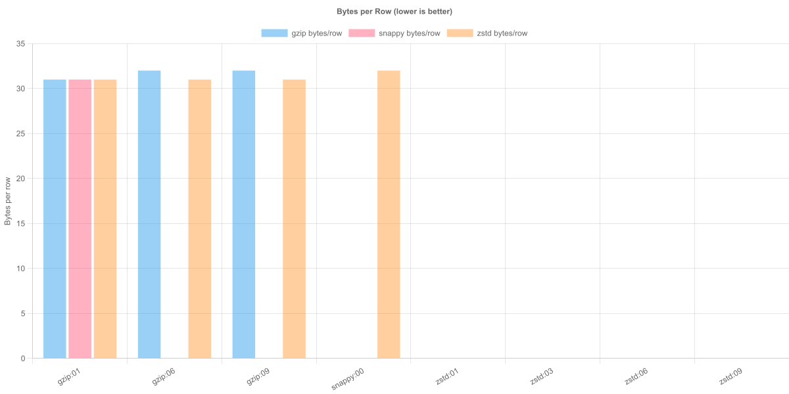
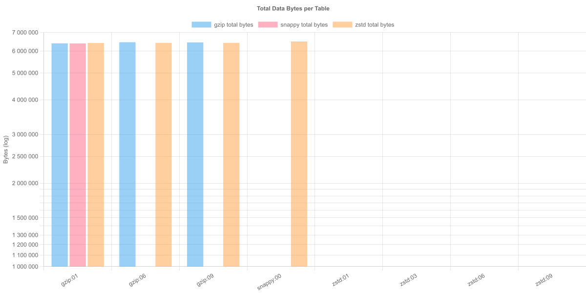
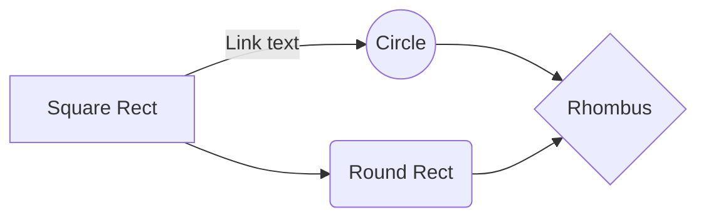

# Hands on iceberg compression codecs and their compression levels through Trino

Project compares storage size with different copmression codecs and levels, also it gives you ability to play with trino.

It cotains docker compose to get all up and runnig, generates charts and gives you ability to define shema with stings, numbers, dates and random elements from an array.

* Define compression codecs and their respective compression levels: 
* Define your schema: 
* Run environment: `docker compose up -d`
* Run bench: `npm run bench`
* Generate charts (uses svg to not bloat git with binary data): `npm run plot`
* Stop environment with volumes deletion: `docker compose down -v`
* Clear `.checkpoints` if you want to rerun generation: `rm -rf .checkpoints`

# Start environment
```sh
docker compose up -d
```

## Dashboards / endpoints

* Trino: http://localhost:8080
* MinIO console: http://localhost:9001 (user/pass from env)

# Working with iceberg through Trino
* Enter trino console in container: `docker compose exec -it trino trino`
* Check Trino works: `SELECT 1;`
* Check Trino node version: `SELECT node_version FROM system.runtime.nodes;`
* `SHOW CATALOGS;`
* `CREATE SCHEMA IF NOT EXISTS iceberg.experiment_schema;`
* `SHOW SCHEMAS FROM iceberg;`
* `CREATE TABLE IF NOT EXISTS iceberg.experiment_schema.experiment_table (id bigint);`
* `SHOW TABLES FROM iceberg.experiment_schema;`
* `SHOW TABLES FROM iceberg.lab;`
* `SHOW CREATE TABLE iceberg.experiment_schema.experiment_table;`
* `INSERT INTO iceberg.experiment_schema.experiment_table VALUES (1);`
* `SELECT * FROM iceberg.experiment_schema.experiment_table;`
* Set simple property: `ALTER TABLE iceberg.experiment_schema.experiment_table SET PROPERTIES format = 'PARQUET';`
* Set compression-codec property through extra_properties: `ALTER TABLE iceberg.experiment_schema.experiment_table SET PROPERTIES extra_properties = map_from_entries(ARRAY[ROW('write.parquet.compression-codec', 'zstd')]);`
* Set compression-level property through extra_properties: `ALTER TABLE iceberg.experiment_schema.experiment_table SET PROPERTIES extra_properties = map_from_entries(ARRAY[ROW('write.parquet.compression-level', '9')]);`
* Show properties of a table: `SELECT * FROM iceberg.experiment_schema."experiment_table$properties";`
* Create table with compression props set through extra_properties `CREATE TABLE IF NOT EXISTS iceberg.experiment_schema.experiment_table_2 (id bigint) WITH (extra_properties = map_from_entries(ARRAY[ROW('write.parquet.compression-codec', 'zstd'), ROW('write.parquet.compression-level', '9')]));`
* Show table props: `SELECT * FROM iceberg.experiment_schema."experiment_table$properties";`
* Show table props: `SELECT * FROM iceberg.experiment_schema."experiment_table_2$properties";`
* Show table props: `SELECT * FROM iceberg.lab."events_zstd_l01$properties";`
* Optimize: `CALL iceberg.system.optimize('lab.events_zstd_l06');`
ALTER TABLE iceberg.lab.events_zstd_l06 EXECUTE optimize;

## Troubleshooting

* Down with volume remove: `docker compose down -v`
* All logs: `docker compose logs -f`
* Logs of the container: `docker compose logs trino`
* Force recreate container: `docker compose up -d --force-recreate trino`
* Check iceberg.properties inside Trino: `docker compose exec -it trino sh -lc 'grep -n "allowed-extra" -n /etc/trino/catalog/iceberg.properties; echo; cat /etc/trino/catalog/iceberg.properties'`
* Check Trino session catalog: `docker compose exec -it trino trino --execute "SHOW CATALOGS"`
* Try to create trino iceberg catalog manually with compression: ```
docker compose exec -it trino trino --execute "
CREATE SCHEMA IF NOT EXISTS iceberg.lab;
CREATE TABLE IF NOT EXISTS iceberg.lab._prop_test (id bigint)
WITH (
  \"write.parquet.compression-codec\" = 'zstd'
)"```
* Check Trino node version: `docker compose exec -it trino trino --execute "SELECT node_version FROM system.runtime.nodes"`
* Check table properties: `docker compose exec -it trino trino --execute "SHOW CREATE TABLE iceberg.lab.events_base"`

WITH (partitioning = ARRAY['month(order_date)', 'bucket(account_number, 10)', 'country']);
WITH (sorted_by = ARRAY['order_date']);

# Benchmark

* Run: `npm run bench`
* Generate charts: `npm run plot`




## Algorithms
You need [Mermaid Preview](https://marketplace.visualstudio.com/items?itemName=vstirbu.vscode-mermaid-preview) extension to see gparhs in vsc

### Example graph

